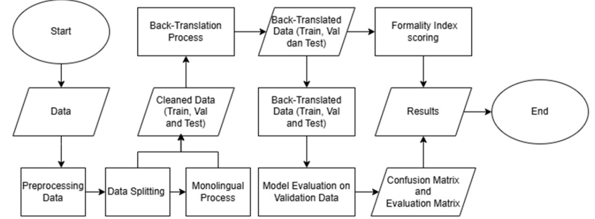
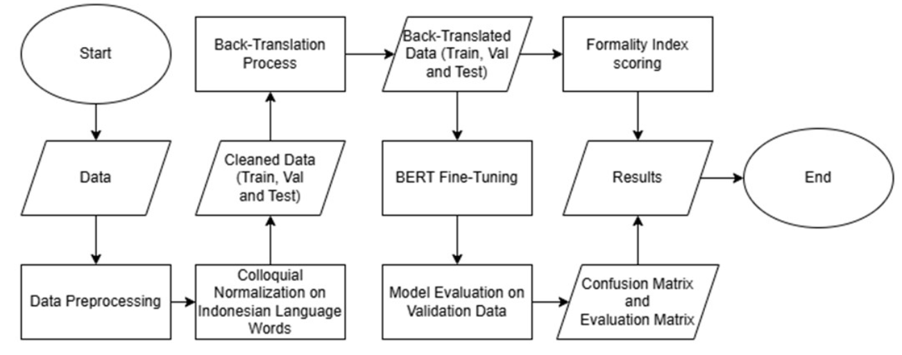
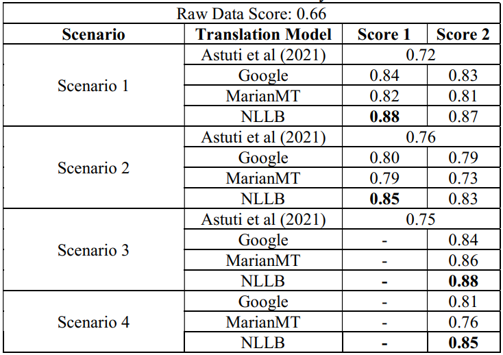
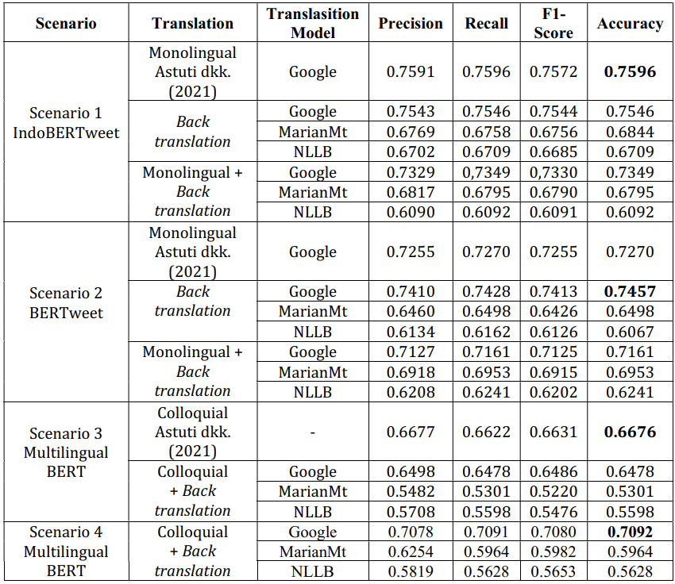

# DEVELOPMENT OF BERT AND BACK TRANSLATION MODELS FOR SENTIMENT ANALYSIS OF CODEMIXED DATA ON TWITTER

by: Nisrina Hanifa Setiono

## Table of Contents

1. [Introduction](#1-introduction)
2. [Experiment Setup](#2-experiment-setup)
3. [Performance Results](#3-performance-results)
4. [Back Translation Results](#4-back-translation-results)
5. [Conclusion](#5-conclusion)
6. [References](#6-references)

## 1. Introduction

The low performance of the BERT model in sentiment analysis on informal code-mixed Twitter data is due to the use of slang, abbreviations, non-standard words, and inconsistencies in spelling and grammar, which do not match the characteristics of formal pretraining data. This mismatch makes it difficult for the model to accurately understand sentence contexts, resulting in low sentiment analysis accuracy. Addressing this challenge is important in the field of natural language processing (NLP), especially for the combination of Indonesian-English commonly used on social media. 

This research aims to improve the performance of the BERT model in analyzing sentiment on code-mixed datasets by developing a combination of the BERT model and back translation techniques. This approach is specifically designed to overcome linguistic challenges in informal Indonesian-English code-mixed data, thereby enhancing the accuracy of sentiment analysis. The proposed method was applied to the INDONGLISH dataset consisting of 5,067 Twitter tweets labeled as positive, negative, or neutral sentiments. 

The results show that applying back translation directly to tweet data produced better results by preserving the original meaning of the sentences, thereby increasing the performance of the BERTweet model from 0.7270 to 0.7457. Conversely, applying back translation after monolingual translation reduced the accuracy of the BERTweet model from 0.7270 to 0.7161. Repeated translation processes significantly altered sentence structure and context, resulting in mismatched sentiment labels. These findings indicate that additional translation steps can negatively impact the accuracy of sentiment analysis, particularly on code-mixed datasets that are highly sensitive to linguistic variations.

_Keywords: Sentiment Analysis, Code-Mixed, BERT, Pretrained Model, Back translation, Text Style Transfer_

## 2. Experiment Setup

### Scenario 1 and 2

The flowchart above illustrates the general workflow for Scenarios 1 and 2. In Scenario 1,
the process begins with data cleaning, preprocessing, and emoji conversion, followed by
translation into Indonesian before applying back-translation (Indonesian-English-Indonesian).

After back-translation, the formality index is computed to measure the formality of the backtranslated data. The processed data is then trained using the IndoBERTweet model, validated, and
evaluated for accuracy, precision, recall, and F-measure.

In Scenario 2, the workflow is similar, but the text is first translated into English, followed
by back-translation (English-Indonesian-English). Formality index is calculated, after which the
data is trained using the BERTweet model, validated, and evaluated with the same metrics as
Scenario 1.

Additionally, both scenarios are also tested without a monolingual setup, where no initial
translation is applied, to compare performance across different preprocessing strategies.

### Scenario 3 and 4

Image above illustrates the workflow for Scenarios 3 and 4. In Scenario 3, the process starts with
data cleaning and colloquial normalization for Indonesian words. The data then undergoes backtranslation (Indonesian-English-Indonesian) and is fine-tuned using the MultilingualBERT
model. The model is then validated and evaluated to generate performance metrics, and the
formality index is calculated to assess the formality of the back-translated data.
In Scenario 4, the steps are similar; however, the back-translation direction is EnglishIndonesian-English before fine-tuning with the same MultilingualBERT model. The formality
index is also measured to evaluate the results of the back-translation process.

## 3. Performance Results

### Formality Index Score

The application of back translation enhances the formality of the text compared to both
the original data and monolingual translation. The original data had a formality score of only 0.66,
indicating that 66% of the words were considered formal, highlighting the presence of informal
elements such as slang, abbreviations, and code-mixing commonly found in raw data. Score 1
represents back translation with monolingual translation, while Score 2 represents back
translation alone, with only a slight difference between them. Overall, back translation
significantly improves the level of text formality across all scenarios. This improvement is
consistent with findings from Astuti et al. (2021), which also showed an increase in formality
scores after applying translation techniques.

### Scenarios Evaluation

The experimental findings indicate that in Scenario 1, IndoBERTweet was used as the
pretrained model, with back translation and a combination of monolingual translation and back
translation applied using various translation models. The results demonstrate that back translation
alone consistently outperformed the monolingual-back translation combination. Among the
translation models, Google Translate achieved the highest performance, yielding results
comparable to previous studies, with a precision of 0.7543, recall of 0.7546, F1-score of 0.7544,
and accuracy of 0.7546. In contrast, MarianMT and NLLB exhibited lower performance, with
MarianMT achieving a precision of 0.6769 and NLLB 0.6702. Notably, when monolingual
translation was introduced before back translation, Google Translate’s accuracy slightly declined
to 0.7349, compared to 0.7546 with back translation alone.
In Scenario 2, which employed BERTweet as the pretrained model, back translation using
Google Translate again produced the best results, surpassing previous studies with an accuracy
of 0.7457. While monolingual preprocessing before back translation improved the performance
of MarianMT and NLLB, it negatively impacted Google Translate’s performance. For instance,
MarianMT’s accuracy increased from 0.6498 (back translation only) to 0.6953 (monolingual +
back translation), whereas Google Translate’s accuracy decreased from 0.7457 to 0.7161. These
findings suggest that while monolingual preprocessing benefits lower-performing translation
models, it does not enhance models that are already highly optimized, such as Google Translate.
In Scenario 3, MultilingualBERT was evaluated using an Indonesian-English-Indonesian
back translation approach, yet the results revealed a performance decline compared to the
colloquial preprocessing method. Conversely, in Scenario 4, applying English → Indonesian →
English back translation significantly improved MultilingualBERT’s accuracy from 0.6676
(Astuti et al., 2021) to 0.7092, underscoring the importance of eliminating code-mixed elements in multilingual text processing. Unlike prior normalization techniques that focused solely on
colloquial terms, back translation standardizes mixed-language text into English, facilitating
better model comprehension. Given that MultilingualBERT’s pretraining corpus comprises 21%
English and less than 2% Indonesian, converting code-mixed text into English enables the model
to leverage its stronger linguistic representations, thereby improving processing efficiency.
Additionally, back translation normalizes sentence structures and removes informal elements,
such as abbreviations and slang, making the text more consistent with the model’s pretraining
data. In contrast, Scenario 3, which retained Indonesian as the final output, exhibited lower
performance due to MultilingualBERT’s limited exposure to Indonesian during pretraining. Table
VIII presents the sentiment prediction results using the Google model without monolingual
translation, compared to the findings from Scenario 2 in the study conducted by by Astuti et al.
(2021).

## 4. Back Translation Results

Based on the research that has been done, here are the results of the Back Translation in
the first scenario. Table 1 presents the results of back-translation using the three models.

### Table 1. Scenario 1

| Original Tweet                                                                                                 | Google                                                                                                            | MarianMT                                                                                                               | NLLB                                                                                  |
| -------------------------------------------------------------------------------------------------------------- | ----------------------------------------------------------------------------------------------------------------- | ---------------------------------------------------------------------------------------------------------------------- | ------------------------------------------------------------------------------------- |
| why people people ini kepo tingkat tinggi? Goks, ampe brightness hape dan laptop gue gelapin masih ajeeee...   | mengapa orang-orang ini berada pada level yang begitu tinggi? Astaga, kecerahan hp dan laptopku pun masih gelap.. | mengapa orang-orang ini tinggi tingkat kepo? Goks, ampe telepon kecerahan dan laptop saya gelap di dalam masih ajee..  | Mengapa orang orang menjaga tingkat tinggi ini?                                       |
| deep talk ternyata sepenting ituuu dan selalu ngerasa terharu setelahnya:pleading_face:                        | Pembicaraan yang mendalam ternyata sangat penting, dan saya selalu merasa terharu setelahnya. :memohon_wajah:     | Pembicaraan yang mendalam ternyata sama pentingnya dengan itu, dan selalu merasa tergerak setelah itu. :memohon_wajah: | Bicara mendalam ternyata menjadi hal yang baik , Dan selalu merasa terharu setelahnya |
| **Monolingual Tweet**                                                                                          | **Google**                                                                                                        | **MarianMT**                                                                                                           | **NLLB**                                                                              |
| mengapa orang -orang ini kepo tingkat tinggi? Goks, kecerahan amp hape dan laptop gue gelapin masih ajeeee ... | kenapa orang-orang ini begitu berlevel tinggi? Ya ampun, kecerahan ponsel dan laptopku masih gelap...             | Goks, ampli kecerahan dan laptopku masih gelap.                                                                        | Kenapa ini tingkat tinggi?                                                            |
| pembicaraan mendalam ternyata memisahkan ituuu, dan selalu ngerasa terharu setelahnya. :pleading_face:         | percakapan yang mendalam sebenarnya memisahkan mereka, dan selalu merasa tersentuh setelahnya. :pleading_face:    | pembicaraan dalam berubah menjadi itu, dan selalu merasa tergerak setelah itu.:pleading_face:                          | Aku selalu merasa terharu setelahnya                                                  |

GoogleTrans adopts a more formal tone, as seen in its translation of "goks" into
"yaampun." and maintaining their overall meaning. MarianMT tends to alter the original focus,
such as in "mengapa orang-orang ini kepo tingkat tinggi?", where the intended criticism of people
shifts to a complaint about screen brightness, changing the original meaning. Meanwhile, NLLB
significantly shortens sentences, making them more concise but often at the cost of essential
details. In contrast, without monolingual translation, the sentence structure remains more faithful
to the original, preserving both tone and meaning with minimal distortion. The direct back
translation approach ensures greater contextual accuracy, and while NLLB continues to simplify
sentences, the overall meaning remains more intact compared to when monolingual translation is
introduced. Table 2 presents the results of back-translation applied to scenario 2 using these
models.

### Table 2. Scenario 2

| Original Tweet                                                                     | Google                                                                                      | MarianMT                                                                                 | NLLB                                                                                       |
| ---------------------------------------------------------------------------------- | ------------------------------------------------------------------------------------------- | ---------------------------------------------------------------------------------------- | ------------------------------------------------------------------------------------------ |
| nama : nn.d hobi : ngajak overthinking bareng                                      | Name: Ms.D Hobby: Inviting overthinking together                                            | name: n.d hobby: invite overthinking together                                            | Mengapa orang orang menjaga tingkat tinggi ini?                                            |
| contohnya langsung ngomong to the point “besok aku ke rumah ya buat lamar kamu”    | for example, say straight to the point "i'll come to your house tomorrow to propose to you" | For example, I’ll go to the point of “”I’m coming home tomorrow”””                       | For example, I’m going to talk to you right away.                                          |
| **Tweet Monolingual**                                                              | **Google**                                                                                  | **MarianMT**                                                                             | **NLLB**                                                                                   |
| name: nn.d hobby: invite overthinking together                                     | name: nn.d hobby: inviting people to think together                                         | name: n.d hobbies: invite overthinks together                                            | I am not interested in this.                                                               |
| for example directly talking to the point “tomorrow I go to home to apply for you” | for example, get straight to the point "tomorrow I will go home to propose to you"          | For example speaking directly to the point “tomorrow I go to the house to apply for you” | For example, speaking directly with the point “Tomorrow I will go home to sign up for you” |

With monolingual translation, Google’s back translation preserves the overall context but
tends to neutralize negative sentiment. For instance, "name: n.d hobby: inviting people to think
together" replaces "overthinking" with "inviting people to think," softening its original nuance.
MarianMT exhibits a shift in focus, as seen in "for example, speaking directly to the point," which
alters the intended meaning.

Meanwhile, NLLB significantly shortens sentences, often resulting
in the loss of crucial details. In contrast, without monolingual translation, Google retains
"overthinking," preserving its original negative connotation. MarianMT maintains key terms
while keeping the sentence structure closer to the source text.

These findings suggest that direct
back translation better preserves the original meaning, whereas monolingual translation
introduces subtle shifts in tone and focus, potentially altering the intended message. Table 3
presents the results of back-translation applied to scenario 3 using these models.

### Table 3. Scenario 3

| Original Tweet                                                                  | Google                                                                                      | MarianMT                                                           | NLLB                                              |
| ------------------------------------------------------------------------------- | ------------------------------------------------------------------------------------------- | ------------------------------------------------------------------ | ------------------------------------------------- |
| literally almost everytime😌                                                    | secara harfiah hampir setiap waktu😌                                                        | Benar-benar hampir setiap kali                                     | Hampir setiap kali                                |
| contohnya langsung ngomong to the point “besok aku ke rumah ya buat lamar kamu” | for example, say straight to the point "i'll come to your house tomorrow to propose to you" | For example, I’ll go to the point of “”I’m coming home tomorrow””” | For example, I’m going to talk to you right away. |

GoogleTrans maintains the closest structural alignment with the original text but may
sound overly rigid. MarianMT enhances emphasis but introduces formatting inconsistencies,affecting readability. Meanwhile, NLLB significantly shortens the translation and alters the
meaning, leading to a loss of nuance. Table 4 presents the results of back-translation applied to
scenario 4 using these models.

### Table 4. Scenario 4

| Original Tweet                                                                                        | Google                                                                                                               | MarianMT                                                                                                                                                                                                              | NLLB                                           |
| ----------------------------------------------------------------------------------------------------- | -------------------------------------------------------------------------------------------------------------------- | --------------------------------------------------------------------------------------------------------------------------------------------------------------------------------------------------------------------- | ---------------------------------------------- |
| sepertinya notif whatsapp Cuma rame karena group bestie dan group kelas sama doang ya bund            | It’s like the WhatsApp notifications are just busy because the bestie group and the class group are the same, bro    | Not if what happens to the group is just Rame because of bestie and the same class group doong ya bund                                                                                                                | I’m not sure if I’m going to be able to do it. |
| keren sih para sutradara, produse dan para pemeran utama tarian lengger maut share lagi kak, kepo aku | It’s really cool that the director, producer and main actors danced the death lengger. Share again, bro, I’m curious | “fontcolor=”” # FFFF00””cool fontcolor=”” # FFFF00””The directors,produce fontcolor=”” # FFFF00””I leadmen fontcolor=”” # FFFF00””deathlenggerdanceshareaga in fontcolor=”” # FFFF00””bro, fontcolor=”” # FFFF00””me” | I’m not sure if I’m going to be able to do it. |

Google Translate maintains the original context more accurately than the other models.
MarianMT introduces anomalies, such as repetitive phrases that distort the sentence structure and
shift neutral expressions toward a more negative tone. Meanwhile, NLLB struggles with certain
sentence structures, often generating generic outputs like "I’m not sure if I’m going to be able to
do it," which diminishes contextual accuracy. These findings highlight the limitations of certain
translation models in handling complex linguistic structures, leading to potential loss of meaning
and coherence.

## 5. Conclusion

Based on the findings of this study, it can be concluded that the application of the back
translation (BT) method using Google on code-mixed data yields optimal results when applied directly to raw data without prior monolingual translation. This is because Google’s BT
effectively preserves the original context and meaning of sentences, leading to a significant
improvement in sentiment analysis model performance. However, when BT is conducted after
monolingual translation, the model’s performance declines due to meaning distortions. Repeated
translation processes, from code-mixed to monolingual and then through BT, can inadvertently
modify sentence structure or context, resulting in shifts in interpretation. Consequently, initial
labeling of the text often becomes inaccurate, as a sentence initially carrying a positive sentiment
may be misinterpreted as negative after multiple translation steps. These findings highlight that
each additional translation process poses a risk of reducing data accuracy, particularly in codemixed datasets, which are highly sensitive to linguistic context shifts.

## 6. References

1. Patwardhan, V., Takawane, G., Kelkar, N., Gaikwad, O., Saraf, R., & Sonawane, S.
   (2023). Analysing The Sentiments Of Marathi-English Code-Mixed Social Media Data
   Using Machine Learning Techniques. 2023 International Conference on Emerging Smart
   Computing and Informatics, ESCI 2023.
   https://doi.org/10.1109/ESCI56872.2023.10100304
2. Widya Astuti, L., & Sari, Y. (2023). Code-Mixed Sentiment Analysis using Transformer
   for Twitter Social Media Data. In IJACSA) International Journal of Advanced Computer
   Science and Applications (Vol. 14, Issue 10). www.ijacsa.thesai.org
3. Najiha, H., & Romadhony, A. (2023). Sentiment Analysis on Indonesian-Sundanese
   Code-Mixed Data. 2023 IEEE 8th International Conference for Convergence in
   Technology, I2CT 2023. https://doi.org/10.1109/I2CT57861.2023.10126254
4. Patil, A., Patwardhan, V., Phaltankar, A., Takawane, G., & Joshi, R. (2023). Comparative
   Study of Pre-Trained BERT Models for Code-Mixed Hindi-English Data. 2023 IEEE 8th
   International Conference for Convergence in Technology, I2CT 2023.
   https://doi.org/10.1109/I2CT57861.2023.10126273.
5. Pota, M., Ventura, M., Catelli, R., & Esposito, M. (2021). An effective bert-based pipeline
   for twitter sentiment analysis: A case study in Italian. Sensors (Switzerland), 21(1), 1–21.
   https://doi.org/10.3390/s21010133.
6. Shorten, C., Khoshgoftaar, T. M., & Furht, B. (2021). Text Data Augmentation for Deep
   Learning. Journal of Big Data, 8(1). https://doi.org/10.1186/s40537-021-00492-0.
7. Sari, Y., & Al Faridzi, F. P. (2023). Unsupervised Text Style Transfer for Authorship
   Obfuscation in Bahasa Indonesia. IJCCS (Indonesian Journal of Computing and
   Cybernetics Systems), 17(1), 23. https://doi.org/10.22146/ijccs.79623.
8. Diva Wijaya, A., & Bram, B. (2021). A SOCIOLINGUISTIC ANALYSIS OF
   INDOGLISH PHENOMENON IN SOUTH JAKARTA (Vol. 4, Issue 4).
   www.news.okezone.com
9. N. A. Salsabila, Y. A. Winatmoko, A. A. Septiandri, and A. Jamal, “Colloquial Indonesian
   Lexicon,” in 2018 International Conference on Asian Language Processing (IALP), 2018,
   pp. 236–239, doi: 10.1109/IALP.2018.8629151.
10. Devlin, J., Chang, M.-W., Lee, K., Google, K. T., & Language, A. I. (n.d.). BERT: Pretraining of Deep Bidirectional Transformers for Language Understanding.
    https://github.com/tensorflow/tensor2tensor
11. N. L. Pham and V. V. Nguyen, "Adapting Neural Machine Translation for EnglishVietnamese using Google Translate system for Back-translation," 2019 International
    Conference on Advanced Computing and Applications (ACOMP), 2019, pp. 1-6.
12. Koto, F., Rahimi, A., Lau, J. H., & Baldwin, T. (2020). IndoLEM and IndoBERT: A
    Benchmark Dataset and Pre-trained Language Model for Indonesian NLP.
    http://arxiv.org/abs/2011.00677
